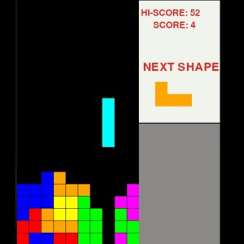

# Tetris



## Overview
This is a Tetris game implemented in Python using the Pygame library. The game includes classic Tetris gameplay with a scoring system and high score tracking. The game's UI features grid lines, current score display, high score display, and a preview of the next Tetromino shape.

## Features
- **Classic Tetris Gameplay**: Rotate and move Tetromino pieces to form complete rows.
- **Scoring System**: Earn points by clearing rows.
- **High Score Tracking**: The game saves and displays the highest score achieved.
- **Next Shape Preview**: Displays the next Tetromino shape to appear.
- **Dynamic Speed Increase**: The fall speed of Tetromino pieces increases as the score increases.

## Installation

1. **Clone the repository**:
    ```bash
    git clone https://github.com/SapporoAlex/Tetris.git
    ```
2. **Navigate to the project directory**:
    ```bash
    cd Tetris
    ```
3. **Install the required dependencies**:
    ```bash
    pip install pygame
    ```

## Usage

To start the game, run the `tetris.py` file:
    ```bash
    python tetris.py
    ```

## Controls

- Left Arrow: Move Tetromino left
- Right Arrow: Move Tetromino right
- Down Arrow: Move Tetromino down faster
- Up Arrow: Rotate Tetromino

## File Structure

- tetris.py: The main game file containing all the game logic and functions.
- highscore.txt: A file to store the high score.
- preview.jpg: Image file for the game preview (should be placed in the same directory as tetris.py).

## Future Improvements

- Add sound effects and background music.
- Implement different game modes (e.g., timed mode, endless mode).
- Enhance the UI with more sophisticated graphics.

## Contributing

Contributions are welcome! If you have any ideas or improvements, feel free to open an issue or submit a pull request.

## Author

Alex McKinley

## License

This project is licensed under the MIT License. See the LICENSE file for more details.
